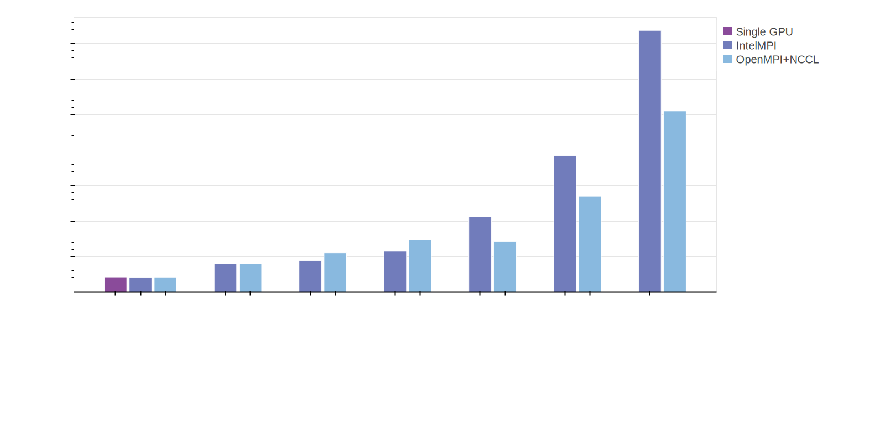
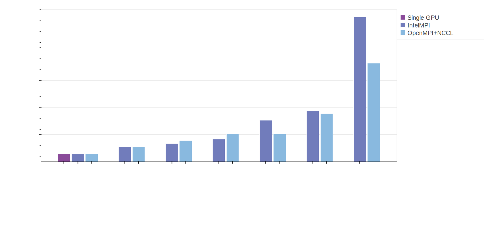
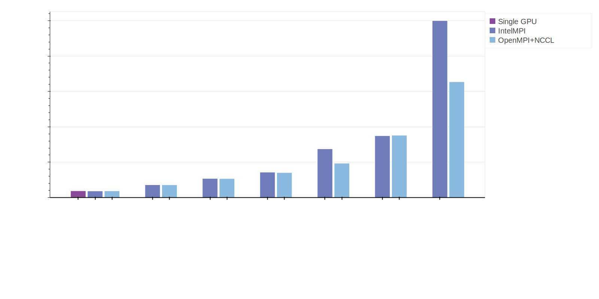
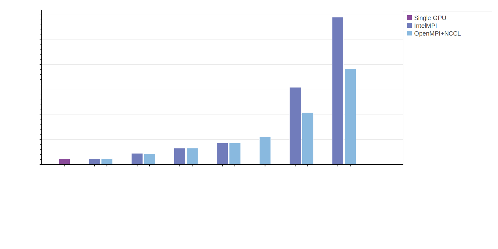
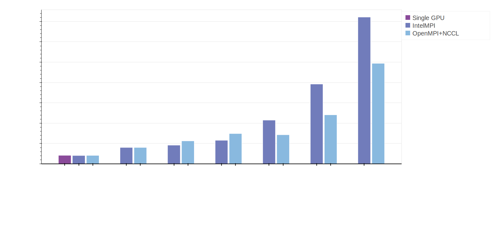

# Batch AI Horovod Benchmark

## ResNet 50
### V100 - ResNet 50

### P100 - ResNet 50

### P40 - ResNet 50

### K80 - ResNet 50

## ResNet 101
### V100 - ResNet 101

### P100 - ResNet 101

## ResNet 152
### V100 - ResNet 152

### P100 - ResNet 152

## Mobilenet V2
### V100 - Mobilenet

### P100 - Mobilenet

## ResNet 50 v2
### V100 - ResNet 50 V2

### P100 - ResNet 50 V2

## ResNet 101 v2
### V100 - ResNet 101 V2

### P100 - ResNet 101 V2

### Gathering results

Look at the Makefiles in the experiments folder

