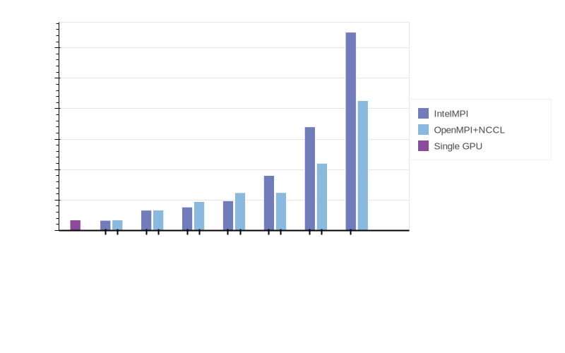

# BatchAIHorovodBenchmark

##### Commands run
make run-bait-local JOB_NAME=1gpulocal

make run-bait-intel JOB_NAME=1gpuintel NUM_NODES=1 PROCESSES_PER_NODE=1
make run-bait-intel JOB_NAME=2gpuintel NUM_NODES=1 PROCESSES_PER_NODE=2
make run-bait-intel JOB_NAME=3gpuintel NUM_NODES=1 PROCESSES_PER_NODE=3
make run-bait-intel JOB_NAME=4gpuintel NUM_NODES=1 PROCESSES_PER_NODE=4

make run-bait-intel JOB_NAME=8gpuintel NUM_NODES=2
make run-bait-intel JOB_NAME=8gpuintel NUM_NODES=4
make run-bait-intel JOB_NAME=8gpuintel NUM_NODES=8

make run-bait-openmpi JOB_NAME=1gpuopen NUM_NODES=1 PROCESSES_PER_NODE=1
make run-bait-openmpi JOB_NAME=2gpuopen NUM_NODES=1 PROCESSES_PER_NODE=2
make run-bait-openmpi JOB_NAME=3gpuopen NUM_NODES=1 PROCESSES_PER_NODE=3
make run-bait-openmpi JOB_NAME=4gpuopen NUM_NODES=1 PROCESSES_PER_NODE=4

make run-bait-openmpi JOB_NAME=8gpuopen NUM_NODES=2
make run-bait-openmpi JOB_NAME=8gpuopen NUM_NODES=4
make run-bait-openmpi JOB_NAME=8gpuopen NUM_NODES=8

